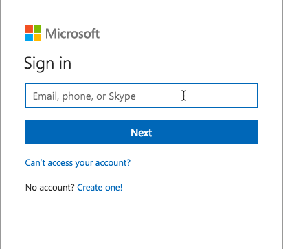
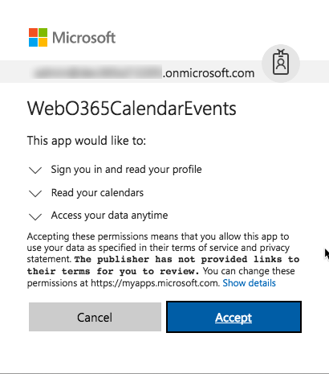
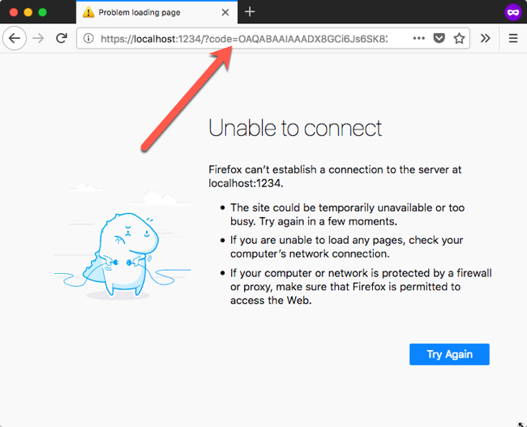
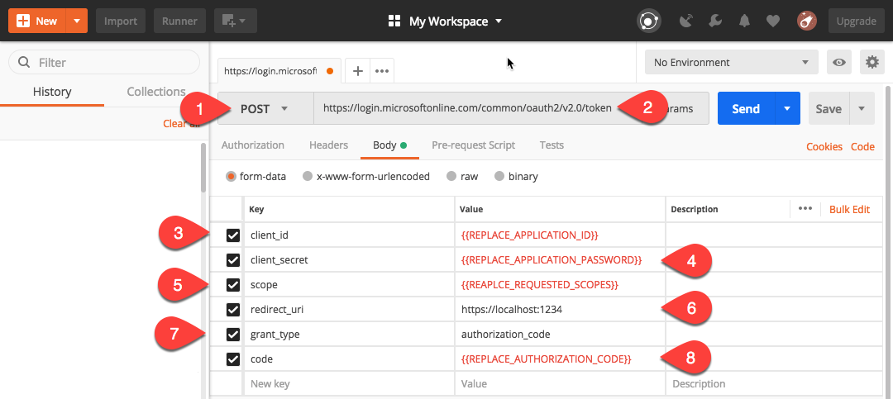

# Working with the Microsoft Graph REST API in Postman

In this demo, you will use a combination of the browser and the HTTP tool [Postman](https://www.getpostman.com/) to authenticate with Azure AD and request data from the Microsoft Graph REST API with raw HTTP requests. This will help you understand the processes involved in authenticating.

## Authenticate with Azure AD and obtain an OAuth2 access token

The first step is to authenticate with Azure AD to establish your identity. Once you do that, you can request an access token.

1. Login and obtain an Azure AD OAuth2 authorization code:
    1. Take the following URL and replace the **{{REPLACE_APPLICATION_ID}}** with the ID you copied previously when creating the Azure AD application in the last step. This is the Azure AD v2 authorization endpoint.

        > Note that the values within the different querystring values are URL encoded. The **scope** value is a space delimited list of the scopes (*aka: permissions*) your application is requesting. In this case: openid, https://graph.microsoft.com/user.read & https://graph.microsoft.com/calendars.read

        ```text
        https://login.microsoftonline.com/common/oauth2/v2.0/authorize?
        client_id={{REPLACE_APPLICATION_ID}}
        &response_type=code
        &redirect_uri=https%3A%2F%2Flocalhost%3A1234
        &response_mode=query
        &scope=openid%20https%3A%2F%2Fgraph.microsoft.com%2Fuser.read%20https%3A%2F%2Fgraph.microsoft.com%2Fcalendars.read
        &state=12345
        ```

    1. Open a browser.
    1. Past the URL into the browser.
    1. When prompted to login, use your Work or School account.

        

    1. After a successful login, you will be prompted to consent to granting the application specific permissions. Review the permissions which match the ones you requested in the URL, and select **Accept**.

        

    1. After accepting the permission consent request, Azure AD will send you the redirect URI specified in the URL you provided. This is the **https://localhost:1234** site, which isn't running so it will show up as a broken page.

        Look at the URL and locate the **code** querystring value. Copy the entire value of the **code** property in the querystring as you will use that to request an access token from Azure AD's v2 token endpoint.

        

        The code value will look like the following. Be sure to only copy the **code** value as there are other querystring properties of **state** and **session_state** that are added after the **code**.

        ```text
        OAQABAAIAAADX8GCi6Js6SK82TsD2Pb7rrzh_YHqdEhLMktqE5WgIgk4jirwDCnPbN-mj4sfVOf_8txfxxlK3xNjNx4dYZH5RNcWrLRtXdl6Amf3U0U_dzJq8csCv84ZsxzYyBafZuPy-7ME7Yt3QRlt0pTJLYC8yUwLrtFEwZio3DZJbcFZhufEkT8gpwboIjhydq1QRZPIoJuXB9dIQ4Dk1p8ziEAj22K1nmEnUXBqtUTmDowGkjJ74ucEVEaOuq6Sbr6N_yUflgzryQq62aKRFr5IxjCETchkRDtX7gYgjCq4kDdvXiYxBhLY6QNTtWp3l1raOK9rpPOfmD4lHQHRGT8LoXrDmR9lCnFKjWfZmF6hkLPwE_6KP-v7oTewgfRZXIYM_zy-GeuQPoe6gTJra2q3y_I3xOJZVkOMk6l-DJohVsb8XkMpfnSWmMZA0xud461jPhqTHo-wjSCBqGKfHsoIjuujqKhXloigpcIYzdwZmtA6ejsKbW-c4Fy17NSbCmkSIjVACsbW3jGt5_JNEGtEA4k8LC_7MHNMGF0NXG0FnjNW7kJrexHV0ygvU_xApgt8kvf81pDAnyxmWR6QP7QY0aHKBagC0gOdzF_YAu25UjTYnmLYxW1Vje6lLIe_yA6qAZ1kH4XStTaDwaH2-DAMzJ_CAIAA
        ```

Use the authorization code to request an OAuth2 access token from Azure AD that will be used to issue calls to the Microsoft Graph

1. Obtain an OAuth2 access token from Azure AD:
    1. Open **Postman**.
    1. Use the following image to guide you in setting the correct values:
        * Set the request type to **POST**
        * Set the URL to **https://login.microsoftonline.com/common/oauth2/v2.0/token**
        * Select the **Body** tab
        * Select the radio button option **form-data**
        * Add a header **client_id** and set it's value to the Azure AD application ID copied previously.
        * Add a header **client_secret** and set it's value to the Azure AD application password copied previously.
        * Add a header **scope** and set it's value to **openid https://graph.microsoft.com/user.read https://graph.microsoft.com/calendars.read**
        * Add a header **redirect_uri** and set it's value to **https://localhost:1234**
        * Add a header **grant_type** and set it's value to **authorization_code**
        * Add a header **code** and set it's value to the value of the authorization code requested in the last step.

        

    1. Select **Send** to execute the request.
    1. The request's response is displayed in the lower half of the Postman application. The response contains the 
        1. **scopes** - the access token has permissions to request
        1. **access_token** - a JWT token used to authenticate with the Microsoft Graph REST API
        1. **id_token** - a JWT token that contains details about the user who logged in

## Use the Microsoft Graph REST API

Use the access token to to get first 20 calendar events from your Office 365 calendar using the Microsoft Graph REST API.

1. Within **Postman**, select the **+** (**plus**) icon to create a new tab for a new request:

      

1. Verify the access token (id_token) obtained in the previous steps works by requesting your own details from the Microsoft Graph REST API:
    1. Set the request type to **GET**
    1. Set the endpoint to **https://graph.microsoft.com/v1.0/me**
    1. Select the **Headers** tab
    1. Add a new header:
        * **Key**: Authorization
        * **Value**: Bearer {{REPLACE_WITH_ACCESS_TOKEN}}
    1. Select **Send** to execute the request

      

1. Update the request to obtain a list the top 20 events from your Office 365 calendar:
    1. In Postman, change the endpoint to **https://graph.microsoft.com/v1.0/me/events**
    1. Select the **Params** button to open the querystring parameter builder.
    1. Add the following parameters:
        * **$select**: subject,start,end
        * **$top**: 20
        * **$skip**: 0
    1. Select **Send** to execute the request

      
