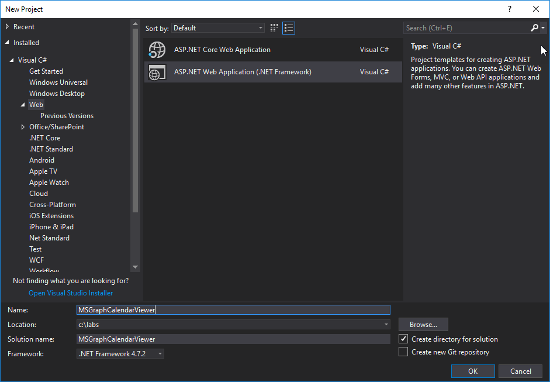

# Create & Configure an ASP.NET MVC Web Application & Configure it for MSAL

In this demo you will create a new ASP.NET MVC web application. After creating it, you will configure it to use the Microsoft Authentication Library (MSAL) to handle all authentication to acquire a token to call the Microsoft Graph API in a later exercise.

1. Open Visual Studio 2017.
1. In Visual Studio, select **File > New > Project**.
1. In the **New Project** dialog, do the following:
    1. Select **Templates > Visual C# > Web**.
    1. Select **ASP.NET Web Application (.NET Framework)**.
    1. Enter **MSGraphCalendarViewer** for the Name of the project.

        

        > Note: Ensure that you enter the exact same name for the Visual Studio Project that is specified in these lab instructions. The Visual Studio Project name becomes part of the namespace in the code. The code inside these instructions depends on the namespace matching the Visual Studio Project name specified in these instructions. If you use a different project name the code will not compile unless you adjust all the namespaces to match the Visual Studio Project name you enter when you create the project.

    1. Select **OK**.
1. In the **New ASP.NET Web Application Project** dialog, do the following:
    1. Select **MVC**.
    1. Select **OK**.

1. Confirm the web project is using SSL by default:

    1. In the **Solution Explorer** tool window, select the project and look at the **Properties** tool window.
    1. Verify the property **SSL Enabled** is set to **TRUE**.
    1. Copy the **SSL URL** property as you will need it later.
    1. Save your changes.

        

        > It is important to do this now because in the next step when you create the application in Azure AD, you want the reply URL to use HTTPS. If you did not do this now, you would have to manually make the changes the Visual Studio wizard is going to do for you in creating the app.

1. Update the Azure AD application with the project's SSL URL:

    1. Open a browser and navigate to the [Azure Active Directory admin center](https://aad.portal.azure.com). Login using a **Work or School Account**.
    1. Select the application you previously created: **WebO365CalendarEvents**.
    1. Select **Authentication** under **Manage**. Locate the **Redirect URIs** section
    1. Select the drop-down **TYPE** as **Web**, and enter enter the SSL URL from the ASP.NET MVC project you just created into the **REDIRECT URI** box. Choose **Save**.

        

1. Update the projects application settings:

    1. Go back to Visual Studio where the project is open.
    1. Open the **web.config** file.
    1. Add the following application settings to the `<appSettings>` XML element. You will update the `ida:AppId` & `ida:AppSecret` properties later. 

        Set the value of `ida:RedirectUri` to the value of the **SSL URL** you copied from a previous step.

          ```xml
          <add key="ida:AppId" value="ENTER_YOUR_APPLICATION_ID" />
          <add key="ida:AppSecret" value="ENTER_YOUR_APPLICATION_SECRET" />
          <add key="ida:RedirectUri" value="ENTER_YOUR_REDIRECT_URL" />
          <add key="ida:GraphScopes" value="User.Read Calendars.Read" />
          ```

1. Add the Microsoft Authentication Library (MSAL) and OWIN middleware packages to the web application:

    1. In Visual Studio, select the menu item **View > Other Windows > Package Manager Console**.
    1. In the **Package Manager Console** tool window, run the following commands to install the necessary packages for MSAL & the OWIN middleware:

        ```powershell
        Install-Package Microsoft.Identity.Client -Version 1.1.4-preview0002
        Install-Package Microsoft.IdentityModel.Tokens
        Install-Package Microsoft.Owin
        Install-Package Microsoft.Owin.Host.SystemWeb
        Install-Package Microsoft.Owin.Security.Cookies
        Install-Package Microsoft.Owin.Security.OpenIdConnect
        Install-Package System.IdentityModel.Tokens.Jwt
        ```
>Note: Do not update bootstrap package past 3.3.7. The default home page and navigation built into the MVC template does not support it.

1. Add authentication startup and configuration classes for MSAL & OWIN middleware:

    1. Add two partial classes that will be executed when the OWIN middleware starts up when the application loads for the first time. These will configure the application to authenticate with Azure AD using specific application credentials and request permissions:
        1. Copy the [LabFiles/Startup.cs](./LabFiles/Startup.cs) file to the root of the project.
        1. Copy the [LabFiles/Startup.Auth.cs](./LabFiles/Startup.Auth.cs) file to the **App_Start** folder in the project.
    1. Add a sample authentication provider to the project that will be used to obtain an OAuth2 access token from Azure AD:
        1. Create a new folder **Helpers** in the root of the project and add the following files to it:
            * [LabFiles/IAuthProvider.cs](./LabFiles/IAuthProvider.cs)
            * [LabFiles/SampleAuthProvider.cs](./LabFiles/SampleAuthProvider.cs)
    1. Create an OAuth2 token cache to store tokens obtained from Azure AD for a performance optimization. The application will first try to retrieve valid, unexpired tokens from the cache before making the round trip to Azure AD:
        1. Create a new folder **TokenStorage** in the root of the project and add the following files to it:
            * [LabFiles/SessionTokenCache.cs](./LabFiles/SessionTokenCache.cs)

1. Update the user interface of the web application support logging into the application

    1. Add an MVC controller that will handle the login and logout process for the application as well as a partial view that contains the login/logout controls.
        1. Copy the [LabFiles/AccountController.cs](./LabFiles/AccountController.cs) file to the **Controllers** folder in the project.
        1. Copy the [LabFiles/_LoginPartial.cshtml](./LabFiles/_LoginPartial.cshtml) file to the **Views/Shared** folder in the project.
    1. Open the **Views/Shared/_Layout.cshtml** file.
    1. Locate the part of the file that includes a few links at the top of the page. It looks similar to the following markup:

        ```html
        <ul class="nav navbar-nav">
            <li>@Html.ActionLink("Home", "Index", "Home")</li>
            <li>@Html.ActionLink("About", "About", "Home")</li>
            <li>@Html.ActionLink("Contact", "Contact", "Home")</li>
        </ul>
        ```

    1. Add the following immediately after the closing `</ul>` tag

        ```html
        @Html.Partial("_LoginPartial")
        ```