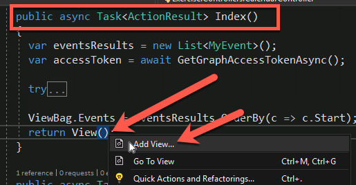
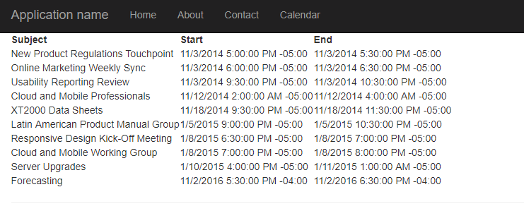

# Update the ASP.NET MVC Application to Leverage the Microsoft Graph REST API

In this demo you will update the ASP.NET MVC application created in the last exercise to call the Microsoft Graph REST API.

1. The Microsoft Graph REST API will return data in an OData JSON response format. To simplify working with the data, use JSON.NET to deserialize the response.
    1. In the **Visual Studio** **Solution Explorer** tool window, right-click the **Models** folder and select **Add > Class**.
    1. Copy the [LabFiles/GraphOdataResponse.cs](./LabFiles/GraphOdataResponse.cs) file to the **Models** folder in the project.
1. Add a new service that will handle all communication with the Microsoft Graph REST API:
    1. In the **Add Class** dialog, name the class **GraphService** and select **Add**.
    1. Add the following `using` statements to the existing ones in the **MyEvents.cs** file that was created.

        ```cs
        using Newtonsoft.Json;
        using Newtonsoft.Json.Linq;
        using System.Net.Http;
        using System.Net.Http.Headers;
        using System.Threading.Tasks;
        ```

    1. Add the following method to the `GraphService` class. This will use the Microsoft Graph REST API to retrieve the first 20 calendar events from your Office 365 calendar. The response is then deserialized into using JSON.NET into a .NET class. The events are then returned back to the caller.

        ```cs
        public async Task<List<GraphOdataEvent>> GetCalendarEvents(string accessToken)
        {
          List<GraphOdataEvent> myEventList = new List<GraphOdataEvent>();

          string query = "https://graph.microsoft.com/v1.0/me/events?$select=subject,start,end&$top=20&$skip=0";

          using (var client = new HttpClient())
          {
            using (var request = new HttpRequestMessage(HttpMethod.Get, query))
            {
              request.Headers.Accept.Add(new MediaTypeWithQualityHeaderValue("application/json"));
              request.Headers.Authorization = new AuthenticationHeaderValue("Bearer", accessToken);

              using (var response = await client.SendAsync(request))
              {
                if (response.IsSuccessStatusCode)
                {
                  var json = await response.Content.ReadAsStringAsync();
                  var result = JsonConvert.DeserializeObject<GraphOdataResponse>(json);
                  myEventList = result.Events.ToList();
                }

                return myEventList;
              }
            }
          }
        }
        ```

1. Add a new ASP.NET MVC controller that will retrieve events from the user's calendar:

    1. In the **Visual Studio** **Solution Explorer** tool window, right-click the **Controllers** folder and select **Add > Controller**.
    1. In the **Add Scaffold** dialog, select **MVC 5 Controller - Empty**, select **Add** and name the controller **CalendarController** and then select **Add**.
    1. Add the following `using` statements to the existing ones in the **CalendarController.cs** file that was created.

        ```cs
        using MSGraphCalendarViewer.Helpers;
        using MSGraphCalendarViewer.Models;
        using System.Net.Http.Headers;
        ```

    1. Decorate the controller to allow only authenticated users to use it by adding `[Authorize]` in the line immediately before the controller:

        ```cs
        [Authorize]
        public class CalendarController : Controller
        ```

    1. Modify the existing `Index()` method to be asynchronous by adding the `async` keyword and modifying the return type to be as follows:

        ```cs
        public async Task<ActionResult> Index()
        ```

    1. Update the `Index()` method to use the `GraphServiceClient` object to call the Microsoft Graph API and retrieve the first 20 events in the user's calendar:

        ```cs
        public async Task<ActionResult> Index()
        {
          GraphService graphService = new GraphService();
          string accessToken = await SampleAuthProvider.Instance.GetUserAccessTokenAsync();

          ViewBag.Events = await graphService.GetCalendarEvents(accessToken);

          return View();
        }
        ```
1. Implement the Calendar controller's associated ASP.NET MVC view:

    1. In the `CalendarController` class method `Index()`, locate the `View()` return statement at the end of the method. Right-click `View()` in the code and select **Add View**:

        

    1. In the **Add View** dialog, set the following values (*leave all other values as their default values*) and select **Add**:

        * **View name:** Index
        * **Template:** Empty (without model)

    1. In the newly created **Views/Calendar/Index.cshtml** file, replace the default code with the following code:

        ```html
        @{
          ViewBag.Title = "Home Page";
        }
        <div>
          <table>
            <thead>
              <tr>
                <th>Subject</th>
                <th>Start</th>
                <th>End</th>
              </tr>
            </thead>
            <tbody>
              @foreach (var o365Event in ViewBag.Events)
              {
                <tr>
                  <td>@o365Event.Subject</td>
                  <td>@o365Event.Start.DateTime</td>
                  <td>@o365Event.End.DateTime</td>
                </tr>
              }
            </tbody>
          </table>
        </div>
        ```

    1. Update the navigation in the **Views/Shared/_Layout.cshtml** file to include a fourth link pointing to a new controller *Calendar*:

        ```html
        <ul class="nav navbar-nav">
          <li>@Html.ActionLink("Home", "Index", "Home")</li>
          <li>@Html.ActionLink("About", "About", "Home")</li>
          <li>@Html.ActionLink("Contact", "Contact", "Home")</li>
          <li>@Html.ActionLink("Calendar", "Index", "Calendar")</li>
        </ul>
        ```

1. Save your changes to all files.

Test the application:

1. Press **F5** to start the application.
1. When the browser loads, select **Signin with Microsoft** and login.
1. If this is the first time running the application, you will be prompted to consent to the application. Review the consent dialog and select **Accept**. The dialog will look similar to the following dialog:

    

1. When the ASP.NET application loads, select the **Calendar** link in the top navigation.
1. You should see a list of calendar items from your calendar appear on the page.

    
