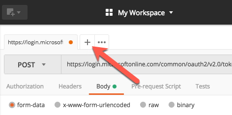
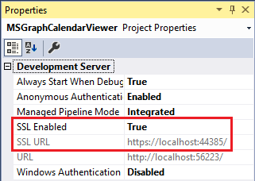
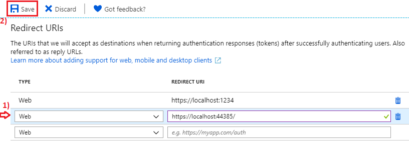
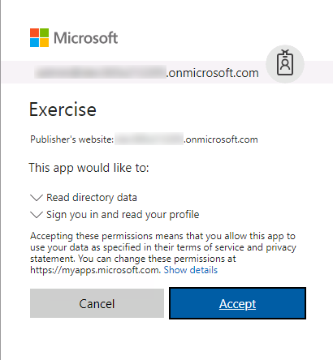

# Building Apps with the Microsoft Graph REST API

In this lab you will leverage the Microsoft Graph REST API to create an ASP.NET MVC application using the Azure AD v2 authentication endpoint and the Microsoft Authentication Library (MSAL) to access data in Office 365. You will also learn how to perform manual authentication with Azure AD and call the Microsoft Graph REST API endpoint using raw HTTP calls.

## In this lab

* [Create an Azure AD web application with the App Registration Portal](#exercise1)
* [Working with the Microsoft Graph REST API in Postman](#exercise2)
* [Create & Configure an ASP.NET MVC Web Application & Configure it for MSAL](#exercise3)
* [Update the ASP.NET MVC Application to Leverage the Microsoft Graph REST API](#exercise4)

## Prerequisites

To complete this lab, you need the following:

* Office 365 tenancy
  * If you do not have one, you obtain one (for free) by signing up to the [Office 365 Developer Program](https://developer.microsoft.com/en-us/office/dev-program).
* [Visual Studio 2017](https://www.visualstudio.com/vs)
* [Postman](https://www.getpostman.com/) - *only the free version is needed for this lab*

<a name="exercise1"></a>

## Exercise 1: Create an Azure AD web application with the App Registration Portal

In this exercise, you will create a new Azure AD native application using the App Registry Portal (ARP).

1. Open a browser and navigate to the **App Registry Portal**: **apps.dev.microsoft.com** and login using a **personal account** (aka: Microsoft Account) or **Work or School Account**.
1. Select **Add an app** at the top of the page.
1. On the **Register your application** page, set the **Application Name** to **WebO365CalendarEvents** and select **Create**.

    

1. On the **WebO365CalendarEvents Registration** page, under the **Properties** section, copy the **Application Id** Guid as you will need it later.

    

1. Scroll down to the **Application Secrets** section

    1. Select **Generate New Password**.
    1. In the **New password generated**, copy the contents of the box as you will need it later. *This password is never shown again, so make sure you copy it now.*

    

1. Scroll down to the **Platforms** section.

    1. Select **Add Platform**.
    1. In the **Add Platform** dialog, select **Web**.

        

    1. In the **Web** platform box added by the previous dialog's selection, enter the URL **https://localhost:1234** for the **Redirect URLs**.

        

        > You will eventually have to come back to add a new URL to this when we know the SSL of the ASP.NET application that you will build in an exercise later in this lab.

1. In the **Microsoft Graph Permissions** section, select **Add** next to the **Delegated Permissions** subsection.

    

    In the **Select Permission** dialog, locate and select the permission **Calendars.Read** and select **OK**:

      

      

1. Scroll to the bottom of the page and select **Save**.

<a name="exercise2"></a>

## Exercise 2: Working with the Microsoft Graph REST API in Postman

In this exercise, you will use a combination of the browser and the HTTP tool [Postman](https://www.getpostman.com/) to authenticate with Azure AD and request data from the Microsoft Graph REST API with raw HTTP requests. This will help you understand the processes involved in authenticating.

## Authenticate with Azure AD and obtain an OAuth2 access token

The first step is to authenticate with Azure AD to establish your identity. Once you do that, you can request an access token.

1. Login and obtain an Azure AD OAuth2 authorization code:
    1. Take the following URL and replace the **{{REPLACE_APPLICATION_ID}}** with the ID you copied previously when creating the Azure AD application in the last step. This is the Azure AD v2 authorization endpoint.

        > Note that the values within the different querystring values are URL encoded. The **scope** value is a space delimited list of the scopes (*aka: permissions*) your application is requesting. In this case: openid, https://graph.microsoft.com/user.read & https://graph.microsoft.com/calendars.read

        ```text
        https://login.microsoftonline.com/common/oauth2/v2.0/authorize?
        client_id={{REPLACE_APPLICATION_ID}}
        &response_type=code
        &redirect_uri=https%3A%2F%2Flocalhost%3A1234
        &response_mode=query
        &scope=openid%20https%3A%2F%2Fgraph.microsoft.com%2Fuser.read%20https%3A%2F%2Fgraph.microsoft.com%2Fcalendars.read
        &state=12345
        ```

    1. Open a browser.
    1. Past the URL into the browser.
    1. When prompted to login, use your Work or School account.

        

    1. After a successful login, you will be prompted to consent to granting the application specific permissions. Review the permissions which match the ones you requested in the URL, and select **Accept**.

        

    1. After accepting the permission consent request, Azure AD will send you the redirect URI specified in the URL you provided. This is the **https://localhost:1234** site, which isn't running so it will show up as a broken page.

        Look at the URL and locate the **code** querystring value. Copy the entire value of the **code** property in the querystring as you will use that to request an access token from Azure AD's v2 token endpoint.

        

        The code value will look like the following. Be sure to only copy the **code** value as there are other querystring properties of **state** and **session_state** that are added after the **code**.

        ```text
        OAQABAAIAAADX8GCi6Js6SK82TsD2Pb7rrzh_YHqdEhLMktqE5WgIgk4jirwDCnPbN-mj4sfVOf_8txfxxlK3xNjNx4dYZH5RNcWrLRtXdl6Amf3U0U_dzJq8csCv84ZsxzYyBafZuPy-7ME7Yt3QRlt0pTJLYC8yUwLrtFEwZio3DZJbcFZhufEkT8gpwboIjhydq1QRZPIoJuXB9dIQ4Dk1p8ziEAj22K1nmEnUXBqtUTmDowGkjJ74ucEVEaOuq6Sbr6N_yUflgzryQq62aKRFr5IxjCETchkRDtX7gYgjCq4kDdvXiYxBhLY6QNTtWp3l1raOK9rpPOfmD4lHQHRGT8LoXrDmR9lCnFKjWfZmF6hkLPwE_6KP-v7oTewgfRZXIYM_zy-GeuQPoe6gTJra2q3y_I3xOJZVkOMk6l-DJohVsb8XkMpfnSWmMZA0xud461jPhqTHo-wjSCBqGKfHsoIjuujqKhXloigpcIYzdwZmtA6ejsKbW-c4Fy17NSbCmkSIjVACsbW3jGt5_JNEGtEA4k8LC_7MHNMGF0NXG0FnjNW7kJrexHV0ygvU_xApgt8kvf81pDAnyxmWR6QP7QY0aHKBagC0gOdzF_YAu25UjTYnmLYxW1Vje6lLIe_yA6qAZ1kH4XStTaDwaH2-DAMzJ_CAIAA
        ```

Use the authorization code to request an OAuth2 access token from Azure AD that will be used to issue calls to the Microsoft Graph

1. Obtain an OAuth2 access token from Azure AD:
    1. Open **Postman**.
    1. Use the following image to guide you in setting the correct values:
        * Set the request type to **POST**
        * Set the URL to **https://login.microsoftonline.com/common/oauth2/v2.0/token**
        * Select the **Body** tab
        * Select the radio button option **form-data**
        * Add a header **client_id** and set it's value to the Azure AD application ID copied previously.
        * Add a header **client_secret** and set it's value to the Azure AD application password copied previously.
        * Add a header **scope** and set it's value to **openid https://graph.microsoft.com/user.read https://graph.microsoft.com/calendars.read**
        * Add a header **redirect_uri** and set it's value to **https://localhost:1234**
        * Add a header **grant_type** and set it's value to **authorization_code**
        * Add a header **code** and set it's value to the value of the authorization code requested in the last step.

        

    1. Select **Send** to execute the request.
    1. The request's response is displayed in the lower half of the Postman application. The response contains the 
        1. **scopes** - the access token has permissions to request
        1. **access_token** - a JWT token used to authenticate with the Microsoft Graph REST API
        1. **id_token** - a JWT token that contains details about the user who logged in

## Use the Microsoft Graph REST API

Use the access token to to get first 20 calendar events from your Office 365 calendar using the Microsoft Graph REST API.

1. Within **Postman**, select the **+** (**plus**) icon to create a new tab for a new request:

      

1. Verify the access token obtained in the previous steps works by requesting your own details from the Microsoft Graph REST API:
    1. Set the request type to **GET**
    1. Set the endpoint to **https://graph.microsoft.com/v1.0/me**
    1. Select the **Headers** tab
    1. Add a new header:
        * **Key**: Authorization
        * **Value**: Bearer {{REPLACE_WITH_ACCESS_TOKEN}}
    1. Select **Send** to execute the request

      

1. Update the request to obtain a list the top 20 events from your Office 365 calendar:
    1. In Postman, change the endpoint to **https://graph.microsoft.com/v1.0/me/events**
    1. Select the **Params** button to open the querystring parameter builder.
    1. Add the following parameters:
        * **$select**: subject,start,end
        * **$top**: 20
        * **$skip**: 0

      

<a name="exercise3"></a>

## Exercise 3: Create & Configure an ASP.NET MVC Web Application & Configure it for MSAL

In this exercise you will create a new ASP.NET MVC web application. After creating it, you will configure it to use the Microsoft Authentication Library (MSAL) to handle all authentication to acquire a token to call the Microsoft Graph API in a later exercise.

1. Open Visual Studio 2017.
1. In Visual Studio, select **File > New > Project**.
1. In the **New Project** dialog, do the following:
    1. Select **Templates > Visual C# > Web**.
    1. Select **ASP.NET Web Application (.NET Framework)**.
    1. Enter **MSGraphCalendarViewer** for the Name of the project.

        

        > Note: Ensure that you enter the exact same name for the Visual Studio Project that is specified in these lab instructions. The Visual Studio Project name becomes part of the namespace in the code. The code inside these instructions depends on the namespace matching the Visual Studio Project name specified in these instructions. If you use a different project name the code will not compile unless you adjust all the namespaces to match the Visual Studio Project name you enter when you create the project.

    1. Select **OK**.
1. In the **New ASP.NET Web Application Project** dialog, do the following:
    1. Select **MVC**.
    1. Select **OK**.

1. Confirm the web project is using SSL by default:

    1. In the **Solution Explorer** tool window, select the project and look at the **Properties** tool window.
    1. Verify the property **SSL Enabled** is set to **TRUE**.
    1. Copy the **SSL URL** property as you will need it later.
    1. Save your changes.

        

        > It is important to do this now because in the next step when you create the application in Azure AD, you want the reply URL to use HTTPS. If you did not do this now, you would have to manually make the changes the Visual Studio wizard is going to do for you in creating the app.

1. Update the Azure AD application with the project's SSL URL:

    1. Open a browser and navigate to the **App Registry Portal**: **apps.dev.microsoft.com** and login using a **personal account** (aka: Microsoft Account) or **Work or School Account**.
    1. Select the application you previously created: **WebO365CalendarEvents**.
    1. Scroll down to the **Platforms** section.
    1. Within the **Web** platform, select **Add URL**.
    1. Enter the SSL URL from the ASP.NET MVC project you just created into the new input box.

        

    1. Scroll to the bottom of the page and select **Save**.

1. Update the projects application settings:

    1. Go back to Visual Studio where the project is open.
    1. Open the **web.config** file.
    1. Add the following application settings to the `<appSettings>` XML element. You will update the `ida:AppId` & `ida:AppSecret` properties later. 

        Set the value of `ida:RedierctUri` to the value of the **SSL URL** you copied from a previous step.

          ```xml
          <add key="ida:AppId" value="ENTER_YOUR_APPLICATION_ID" />
          <add key="ida:AppSecret" value="ENTER_YOUR_APPLICATION_SECRET" />
          <add key="ida:RedirectUri" value="ENTER_YOUR_REDIRECT_URL" />
          <add key="ida:GraphScopes" value="User.Read Calendars.Read" />
          ```

1. Add the Microsoft Authentication Library (MSAL) and OWIN middleware packages to the web application:

    1. In Visual Studio, select the menu item **View > Other Windows > Package Manager Console**.
    1. In the **Package Manager Console** tool window, run the following commands to install the necessary packages for MSAL & the OWIN middleware:

        ```powershell
        Install-Package Microsoft.Identity.Client -Pre
        Install-Package Microsoft.IdentityModel.Tokens
        Install-Package Microsoft.Owin
        Install-Package Microsoft.Owin.Host.SystemWeb
        Install-Package Microsoft.Owin.Security.Cookies
        Install-Package Microsoft.Owin.Security.OpenIdConnect
        Install-Package System.IdentityModel.Tokens.Jwt
        ```

1. Add authentication startup and configuration classes for MSAL & OWIN middleware:

    1. Add two partial classes that will be executed when the OWIN middleware starts up when the application loads for the first time. These will configure the application to authenticate with Azure AD using specific application credentials and request permissions:
        1. Copy the [LabFiles/Startup.cs](./LabFiles/Startup.cs) file to the root of the project.
        1. Copy the [LabFiles/Startup.Auth.cs](./LabFiles/Startup.Auth.cs) file to the **App_Start** folder in the project.
    1. Add a sample authentication provider to the project that will be used to obtain an OAuth2 access token from Azure AD:
        1. Create a new folder **Helpers** in the root of the project and add the following files to it:
            * [LabFiles/IAuthProvider.cs](./LabFiles/IAuthProvider.cs)
            * [LabFiles/SampleAuthProvider.cs](./LabFiles/SampleAuthProvider.cs)
    1. Create an OAuth2 token cache to store tokens obtained from Azure AD for a performance optimization. The application will first try to retrieve valid, unexpired tokens from the cache before making the round trip to Azure AD:
        1. Create a new folder **TokenStorage** in the root of the project and add the following files to it:
            * [LabFiles/SessionTokenCache.cs](./LabFiles/SessionTokenCache.cs)

1. Update the user interface of the web application support logging into the application

    1. Add an MVC controller that will handle the login and logout process for the application as well as a partial view that contains the login/logout controls.
        1. Copy the [LabFiles/AccountController.cs](./LabFiles/AccountController.cs) file to the **Controllers** folder in the project.
        1. Copy the [LabFiles/_LoginPartial.cshtml](./LabFiles/_LoginPartial.cshtml) file to the **Views/Shared** folder in the project.
    1. Open the **Views\Shared\_Layout.cshtml** file.
    1. Locate the part of the file that includes a few links at the top of the page. It looks similar to the following markup:

        ```html
        <ul class="nav navbar-nav">
            <li>@Html.ActionLink("Home", "Index", "Home")</li>
            <li>@Html.ActionLink("About", "About", "Home")</li>
            <li>@Html.ActionLink("Contact", "Contact", "Home")</li>
        </ul>
        ```

    1. Add the following immediately after the closing `</ul>` tag

        ```html
        @Html.Partial("_LoginPartial")
        ```

<a name="#exercise4"></a>

## Exercise 4: Update the ASP.NET MVC Application to Leverage the Microsoft Graph REST API

In this exercise you will update the ASP.NET MVC application created in the last exercise to call the Microsoft Graph REST API.

1. The Microsoft Graph REST API will return data in an OData JSON response format. To simplify working with the data, use JSON.NET to deserialize the response.
    1. In the **Visual Studio** **Solution Explorer** tool window, right-click the **Models** folder and select **Add > Class**.
    1. Copy the [LabFiles/GraphOdataResponse.cs](./LabFiles/GraphOdataResponse.cs) file to the **Models** folder in the project.
1. Add a new service that will handle all communication with the Microsoft Graph REST API:
    1. In the **Add Class** dialog, name the class **GraphService** and select **Add**.
    1. Add the following `using` statements to the existing ones in the **MyEvents.cs** file that was created.

        ```cs
        using Newtonsoft.Json;
        using Newtonsoft.Json.Linq;
        using System.Net.Http;
        using System.Net.Http.Headers;
        using System.Threading.Tasks;
        ```

    1. Add the following method to the `GraphService` class. This will use the Microsoft Graph REST API to retrieve the first 20 calendar events from your Office 365 calendar. The response is then deserialized into using JSON.NET into a .NET class. The events are then returned back to the caller.

        ```cs
        public async Task<List<GraphOdataEvent>> GetCalendarEvents(string accessToken)
        {
          List<GraphOdataEvent> myEventList = new List<GraphOdataEvent>();

          string query = "https://graph.microsoft.com/v1.0/me/events?$select=subject,start,end&$top=20&$skip=0";

          using (var client = new HttpClient())
          {
            using (var request = new HttpRequestMessage(HttpMethod.Get, query))
            {
              request.Headers.Accept.Add(new MediaTypeWithQualityHeaderValue("application/json"));
              request.Headers.Authorization = new AuthenticationHeaderValue("Bearer", accessToken);

              using (var response = await client.SendAsync(request))
              {
                if (response.IsSuccessStatusCode)
                {
                  var json = await response.Content.ReadAsStringAsync();
                  var result = JsonConvert.DeserializeObject<GraphOdataResponse>(json);
                  myEventList = result.Events.ToList();
                }

                return myEventList;
              }
            }
          }
        }
        ```

1. Add a new ASP.NET MVC controller that will retrieve events from the user's calendar:

    1. In the **Visual Studio** **Solution Explorer** tool window, right-click the **Controllers** folder and select **Add > Controller**.
    1. In the **Add Scaffold** dialog, select **MVC 5 Controller - Empty**, select **Add** and name the controller **CalendarController** and then select **Add**.
    1. Add the following `using` statements to the existing ones in the **CalendarController.cs** file that was created.

        ```cs
        using MSGraphCalendarViewer.Helpers;
        using MSGraphCalendarViewer.Models;
        using System.Net.Http.Headers;
        ```

    1. Decorate the controller to allow only authenticated users to use it by adding `[Authorize]` in the line immediately before the controller:

        ```cs
        [Authorize]
        public class CalendarController : Controller
        ```

    1. Modify the existing `Index()` method to be asynchronous by adding the `async` keyword and modifying the return type to be as follows:

        ```cs
        public async Task<ActionResult> Index()
        ```

    1. Update the `Index()` method to use the `GraphServiceClient` object to call the Microsoft Graph API and retrieve the first 20 events in the user's calendar:

        ```cs
        public async Task<ActionResult> Index()
        {
          GraphService graphService = new GraphService();
          string accessToken = await SampleAuthProvider.Instance.GetUserAccessTokenAsync();

          ViewBag.Events = await graphService.GetCalendarEvents(accessToken);

          return View();
        }
        ```
1. Implement the Calendar controller's associated ASP.NET MVC view:

    1. In the `CalendarController` class method `Index()`, locate the `View()` return statement at the end of the method. Right-click `View()` in the code and select **Add View**:

        

    1. In the **Add View** dialog, set the following values (*leave all other values as their default values*) and select **Add**:

        * **View name:** Index
        * **Template:** Empty (without model)

    1. In the newly created **Views/Calendar/Index.cshtml** file, replace the default code with the following code:

        ```html
        @{
          ViewBag.Title = "Home Page";
        }
        <div>
          <table>
            <thead>
              <tr>
                <th>Subject</th>
                <th>Start</th>
                <th>End</th>
              </tr>
            </thead>
            <tbody>
              @foreach (var o365Event in ViewBag.Events)
              {
                <tr>
                  <td>@o365Event.Subject</td>
                  <td>@o365Event.Start.DateTime</td>
                  <td>@o365Event.End.DateTime</td>
                </tr>
              }
            </tbody>
          </table>
        </div>
        ```

    1. Update the navigation in the **Views/Shared/_Layout.cshtml** file to include a fourth link pointing to a new controller *Calendar*:

        ```html
        <ul class="nav navbar-nav">
          <li>@Html.ActionLink("Home", "Index", "Home")</li>
          <li>@Html.ActionLink("About", "About", "Home")</li>
          <li>@Html.ActionLink("Contact", "Contact", "Home")</li>
          <li>@Html.ActionLink("Calendar", "Index", "Calendar")</li>
        </ul>
        ```

1. Save your changes to all files.

Test the application:

1. Press **F5** to start the application.
1. When the browser loads, select **Signin with Microsoft** and login.
1. If this is the first time running the application, you will be prompted to consent to the application. Review the consent dialog and select **Accept**. The dialog will look similar to the following dialog:

    

1. When the ASP.NET application loads, select the **Calendar** link in the top navigation.
1. You should see a list of calendar items from your calendar appear on the page.

    
